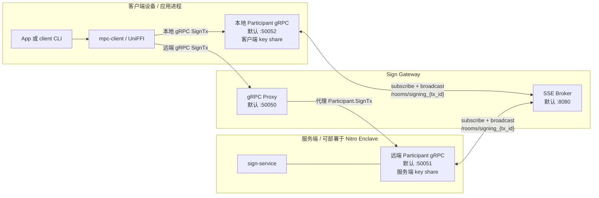
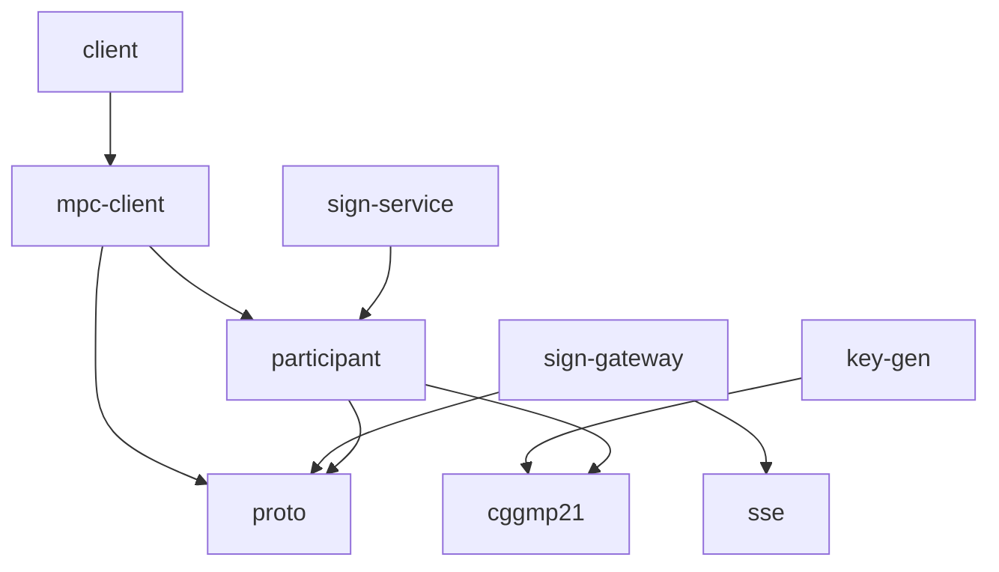
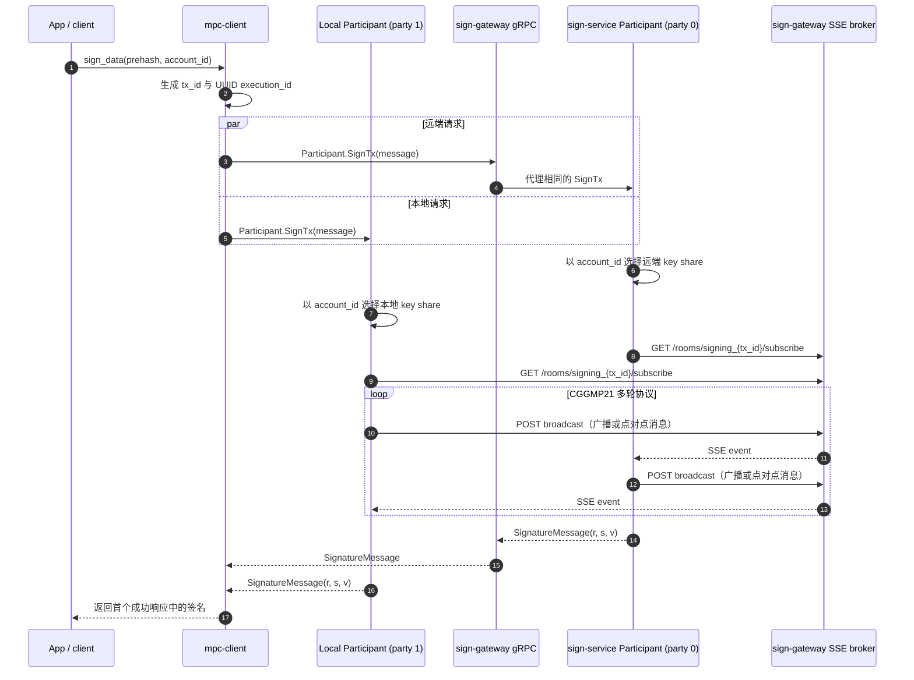
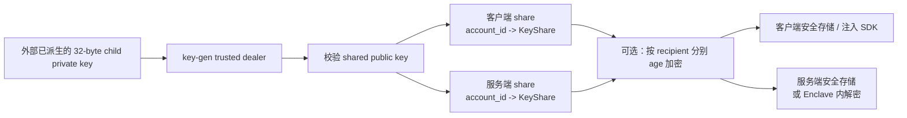

# Wallet MPC 架构说明

本文描述仓库**当前已经实现的架构**，而不是目标态设计。若本文与代码发生冲突，以
`proto/proto/mpc.proto`、各 crate 的 `src/` 实现和 `config/` 为准。

## 1. 系统目标与当前边界

Wallet MPC 使用 CGGMP21 threshold ECDSA，在 secp256k1 上协同产生签名。当前主路径
是固定两方的 2-of-2 模式：

- 客户端侧持有 party 1 的账户密钥分片，并在进程内启动本地 participant；
- 服务端 `sign-service` 持有 party 0 的账户密钥分片；
- 双方都不能单独重建完整私钥或独立完成签名；
- `sign-gateway` 提供外部 gRPC 入口，并作为双方交换 CGGMP21 轮次消息的 SSE
  broker；
- 每个 `account_id` 对应预先派生好的独立 key share，当前签名阶段不执行 BIP-32 或
  SLIP-10 派生。

protobuf 中保留了 Bitcoin 枚举，key generator 也接受一般化的门限参数，但当前运行
时签名 party 集合仍硬编码为 `[0, 1]`，客户端也固定发起 Ethereum 类型的签名。因而
“任意 m-of-n”和完整 Bitcoin 钱包流程都不属于当前可用能力。

## 2. 运行时拓扑

系统有两个相互独立但同时参与一次签名的数据平面：

1. **控制/请求平面（gRPC）**：SDK 同时触发本地和远端 participant；远端请求先经过
   gateway，再代理到 sign-service。
2. **MPC 消息平面（HTTP + SSE）**：两个 participant 在同一 room 内广播和订阅
   CGGMP21 多轮消息。



gateway 的 gRPC proxy 和 SSE broker 共享一个进程，但不是同一种协议，也不互相转发
载荷。排查卡住的签名时，需要分别检查 gRPC 请求链路与 SSE room 消息链路。

## 3. 组件职责

| 组件 | 类型 | 核心职责 | 主要依赖/接口 |
| --- | --- | --- | --- |
| `client` | 二进制 | 示例性构造 EIP-1559 交易 prehash，加载 YAML/key shares，调用 SDK 并验证签名 | `mpc-client`, Alloy |
| `mpc-client` | Rust/FFI 库 | 提供同步 UniFFI API；管理 Tokio runtime、本地 participant 和 gRPC clients；生成 `tx_id`/`execution_id` | `participant`, `proto`, Tonic, UniFFI |
| `participant` | Rust 库/可选二进制 | 加载指定账户的分片，承载 `Participant.SignTx`，把 CGGMP21 round-based transport 适配到 SSE | `cggmp21`, `proto`, `reqwest` |
| `sign-service` | 二进制 | 从文件加载远端分片并启动 participant gRPC 服务；处理信号与优雅退出 | `participant` |
| `sign-gateway` | 二进制 | 对外暴露 `Participant`/`SignGateway` gRPC 服务并代理到 sign-service；同时启动 SSE broker | `proto`, `sse` |
| `sse` | Rust 库/二进制 | 在内存中维护 room、消息历史和订阅者；提供 subscribe/broadcast/index HTTP API | Actix Web |
| `proto` | Rust 库 | 从 protobuf 生成 Tonic client/server 类型 | Prost, Tonic |
| `key-gen` | 二进制/库 | 可信 dealer 从已派生 child private key 生成 account-specific shares，可用 age recipient 分别加密 | `cggmp21`, age |

### 3.1 编译期依赖关系



`vendor/fast-paillier` 和 `vendor/gmp-mpfr-sys` 是 workspace/native cryptography 支撑，
不承担应用层编排职责。

## 4. 签名流程

调用方必须传入要签名的 hash/prehash；`participant` 会把它直接映射为
`DataToSign`，不会再做一次链级哈希。



关键关联标识：

- `tx_id`：由 16-bit 实例标识与 16-bit 自增计数组合；同时决定 SSE room
  `signing_{tx_id}`。
- `execution_id`：每次请求生成的 UUID 字节，作为 CGGMP21 `ExecutionId`，隔离协议
  execution。
- `account_id`：在双方各自的 key-share map 中选择同一账户对应的分片。
- party index：来自序列化 key share 的 `core.i`，当前必须与 `[0, 1]` 匹配。

SDK 会向 `all_participant_clients` 的前 `threshold` 个 client 并发发请求。当前列表顺序
是远端 gateway 在前、本地 participant 在后；2-of-2 配置会调用两者。SDK 最终只检查
是否至少收到一个成功的 gRPC 响应，但底层任一 participant 要产生该响应，CGGMP21
本身仍必须等到两方完成协作。

## 5. 协议与数据契约

### 5.1 gRPC

定义位于 `proto/proto/mpc.proto`：

- `Participant.SignTx`：participant 的实际签名接口；gateway 为兼容客户端也暴露并
  代理这个 service。
- `SignGateway.SignTx`：语义相同的 gateway service，目前同样直接代理给
  sign-service。
- `SignMessage`：
  - `tx_id`：请求/room 标识；
  - `execution_id`：CGGMP21 execution 标识；
  - `chain`：`Ethereum` 或 `Bitcoin`；
  - `data`：已准备好的签名输入；
  - `account_id`：分片选择键。
- `SignatureMessage`：大端字节形式的 `r`、`s` 和恢复标识 `v`。

修改 protobuf 时必须保持已有 field number；生成代码由 `proto/build.rs` 在构建时
产生。

### 5.2 SSE broker

| 方法 | 路径 | 作用 |
| --- | --- | --- |
| `GET` | `/rooms/{room_id}/subscribe` | 打开 SSE 流；可用 `Last-Event-ID` 继续读取内存历史。 |
| `POST` | `/rooms/{room_id}/broadcast` | 向 room 追加一条 JSON 编码的 round-based 消息。 |
| `POST` | `/rooms/{room_id}/issue_unique_idx` | 分配 room 内索引；当前主签名路径没有使用它。 |

transport 消息包含 `sender`、可选 `receiver` 与泛型协议 body。接收端丢弃自己发送的
消息以及发给其他 party 的点对点消息。

## 6. 密钥生命周期



当前 `key-gen` 是**可信 dealer**，运行时会接触完整 child private key。它不是分布式
DKG。输出文件以 `account_id` 为键，可以追加多个账户；加密输出不能由工具直接追加，
需要先在受控环境中处理。生成阶段属于最高敏感边界，不能记录或泄露 child key、明文
share 或 age identity。

`sign-service` 启动时把整个账户到 key share 的 map 载入内存。环境变量
`SIGN_SERVICE_KEY_SHARE_FILE` 优先于 YAML 中的文件路径，供容器和 Enclave 注入解密
后的临时路径使用。客户端则把各账户的 share JSON 通过 `MpcConfig.key_shares` 注入
SDK，本地 participant 启动前解析到内存。

## 7. 配置与端口

| 默认端口 | 进程 | 协议/方向 |
| --- | --- | --- |
| `8080` | `sign-gateway` / `sse` | HTTP + SSE；两个 participant 的 MPC round transport。 |
| `50050` | `sign-gateway` | 对客户端的 gRPC 入口。 |
| `50051` | `sign-service` | gateway 到远端 participant 的 gRPC。 |
| `50052` | 客户端内嵌 participant | SDK 到本地 participant 的 loopback gRPC。 |

配置关系：

- `config/sign-gateway.yaml` 同时配置 SSE bind、gRPC bind 和 sign-service upstream；
- `config/sign-service.yaml` 配置 SSE gateway URL、participant bind 和 share 文件；
- `config/client.yaml` 配置 SSE URL、本地 participant、gateway gRPC 入口及 MPC 参数。

checked-in 配置同时包含 Docker/远端示例值，例如 `/app/...`、
`host.docker.internal` 和公网地址，不应被视为开箱即用的 localhost profile。

## 8. 状态、并发与生命周期

- SSE 的 room、消息历史、subscriber count 和 next index 都只存在进程内存中；重启会
  全部丢失。
- room 当前没有回收机制，消息历史在进程生命周期内持续保留；payload 上限为 100 MB。
- `MpcSigner` 内部用 mutex 持有一个 `Signer`，同步 FFI 方法通过自有 Tokio runtime
  执行；同一个 signer 实例上的签名调用实际上被串行化。
- `tx_id` 未持久化，通过时间片段、随机字节和进程内计数降低碰撞概率；broker 没有
  服务端全局唯一性校验。
- sign-service 在启动时加载 share，运行过程中不会自动热重载。
- 服务进程响应 Ctrl+C/SIGTERM，并尝试关闭 gRPC/SSE server；SDK 关闭时会停止内嵌
  participant。

## 9. 部署模型

### 9.1 标准进程/容器部署

推荐启动依赖顺序为：

1. `sign-service`；
2. `sign-gateway`（启动时连接 sign-service upstream）；
3. 客户端/SDK（初始化时连接 gateway，并启动本地 participant）。

`scripts/sign-service/` 和 `scripts/sign-gateway/` 提供构建、Docker 和远端运行脚本。
部署时需要显式核对 host/container 间的 `50050`、`50051`、`8080` 映射。

### 9.2 AWS Nitro Enclave 部署

生产扩展把远端 `sign-service` 与服务端 share 放进 Nitro Enclave：父机从 S3 获取
KMS 加密的 age identity 与 age 加密的 shares，将材料经 vsock 注入；Enclave 内使用
带 attestation 的 `kmstool_enclave_cli` 解密 age identity，再解密 shares 并启动
sign-service。KMS 出站经父机的 vsock proxy，gRPC/SSE 流量也通过 host/enclave
bridge。

具体端口、PCR policy 和操作步骤见：

- `Sign-service-in-enclave.md`
- `scripts/sign-service/README.md`
- `docs/kms-attestation-policy.md`
- `docs/kmstool-enclave-cli.md`

Enclave 保护服务端 share 免受父机直接读取，但不会自动为公网 gRPC/SSE 增加身份认证、
TLS、授权或限流；这些仍需由外围网络与服务层提供。

## 10. 信任边界与安全属性

| 边界 | 能看到的内容 | 不应获得的内容 | 当前注意事项 |
| --- | --- | --- | --- |
| 客户端应用/SDK | 待签名 prehash、账户 ID、客户端 share、最终签名 | 服务端 share | 客户端进程被攻陷会暴露一份 share。 |
| sign-gateway | gRPC 请求元数据/签名输入、MPC round 消息、最终响应 | 任一明文 share | 默认链路是明文且无应用层鉴权。 |
| sign-service/Enclave | 服务端 share、签名输入、MPC round 状态 | 客户端 share | 非 Enclave 部署依赖主机文件/进程隔离。 |
| key-gen 环境 | 完整 child private key、生成的全部 shares | 无 | 最高信任级别；必须隔离、清理并审计。 |
| S3/KMS/父机 | 加密 artifacts、attestation/传输元数据 | Enclave 内明文 share/age identity | 安全性取决于 KMS policy、PCR 与操作权限。 |

2-of-2 消除了单个 share 独立签名的能力，但不等于完整系统安全。gateway 的可用性、
请求授权、重放控制、客户端完整性、dealer 环境和 supply-chain 仍属于安全模型的一部分。

## 11. 已知实现约束

以下是源码中的当前约束，修改相关区域时应同步更新本文：

- `participant::Signing` 固定以 `[0, 1]` 创建 CGGMP21 signing session；动态 party
  index API 尚未接入主流程。
- `threshold` 在 SDK 中主要用于选择前几个 gRPC clients；`total_participants` 并未驱动
  participant discovery 或动态拓扑。
- SDK 只要求至少一个成功 gRPC 响应后返回第一个签名；没有在响应层验证所有成功响应
  完全一致。
- gateway 启动时要求 sign-service 可连接，当前没有惰性连接或后台重试初始化。
- SSE broker 无持久化、room TTL、消息上限/清理策略、鉴权、租户隔离和 backpressure
  管理。
- 默认 gRPC 与 SSE 都没有 TLS、身份认证、请求授权或速率限制。
- `Chain::Bitcoin` 仅返回占位恢复标识；`mpc-client` 当前固定发送 Ethereum。
- CLI 是演示/测试程序，包含特定测试网参数，不是通用交易服务或生产钱包前端。

## 12. 变更影响导航

| 变更目标 | 通常需要一起检查 |
| --- | --- |
| gRPC 字段或 service | `proto/`, `participant/`, `mpc-client/`, `sign-gateway/`，以及所有 README/FFI 调用方。 |
| CGGMP21 参数、party 数或 room 规则 | `participant/`, `mpc-client/`, `sse/`, key-share 兼容性和端到端部署。 |
| UniFFI API | `mpc-client/src/lib.rs`, `.udl`, `build.rs`, `release.sh` 和移动端生成物。 |
| share 文件格式或账户选择 | `key-gen/`, `participant/`, `sign-service/`, `client/`, Enclave 注入脚本。 |
| gateway 端口/上游关系 | 三份 `config/*.yaml`、两个 `scripts/*` 目录、容器/安全组/vsock bridge。 |
| KMS/Enclave 流程 | `scripts/sign-service/`, Enclave 文档、KMS policy、PCR 测量和 secret 生命周期。 |

## 13. 构建与验证基线

仓库使用 Rust 1.88.0。常用基线命令：

```bash
cargo fmt --all -- --check
cargo check --workspace
cargo test --workspace
```

完整构建会编译 vendored GMP/MPFR 和密码学依赖，首次执行可能较慢。涉及运行时签名的
改动，除 crate 单测外还应验证：gateway 的两个监听端口、两条 gRPC request path、两个
participant 对同一 SSE room 的收发、相同 `account_id` 的 share 配对，以及 shutdown
路径。任何端到端测试都应使用合成测试 shares，不应输出仓库中现有 share 文件内容。
