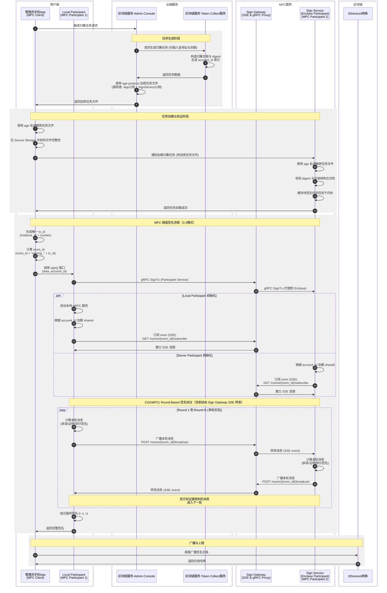

# 1. 概述（Overview）

Phemex Global 的 Ethereum 用户入金地址目前由冷钱包统一管理，随着 ERC‑20 资产种类与数量的增加，冷钱包模式在归集与调配上存在延迟与运营风险。

为此，我们设计一套基于 MPC（多方安全计算） 的资产归集与退款系统，以实现 安全、可审计、可自动化 的资产管理流程。

本系统基于 CGGMP24 阈值签名协议（3‑2 模式），通过将原冷钱包主密钥拆分为三个 share，并分布式存储在不同安全环境中（手机端 + 云端 Enclave + 备用节点），**实现无需集中私钥的安全签名与资产归集**。

系统主要功能包括：

* 自动生成归集任务（从用户入金地址到归集地址）

* MPC 多方签名与交易广播

* 文件级加密与审计追踪

* 支持退款流程

***

# 2. 需求目标（Goals）

本系统的总体目标如下：

1. 及时归集

    * 常规情况下，归集任务应在 24 小时内完成。

    * 紧急模式下（如市场剧烈波动），应支持 1 小时内完成归集。

2. 资产安全

    * 使用 CGGMP24 协议的 3‑2 阈值签名方案，确保私钥从不集中存储。

    * 所有签名操作均在安全环境（手机端 Secure Storage、AWS Nitro Enclave）中执行。

3. 可审计性

    * 每个归集任务、签名步骤、交易广播均生成不可篡改的审计日志。

    * 所有任务文件与签名记录均加密存档，支持追溯与合规审计。

4. 用户无感知

    * 归集与退款流程完全后台自动化，对用户体验无影响。

    * 用户资产余额与入金地址保持不变。

5. 多端协作

    * 手机端 App 负责触发签名流程与人工确认。

    * 云端 Enclave 节点参与 MPC 协议完成签名计算。

    * Blockchain Service 负责任务生成与日志记录。

6. 退款支持（可选扩展）

    * 支持异常入金、超额入金的退款处理。

    * 退款任务与归集任务共用 MPC 签名与审计机制。

参考文档：[ Migrate Ethereum Users Deposits Addresses to Warm Wallets](https://cmex-pro.jp.larksuite.com/wiki/GbbRwNvhSij5CDkyu5ij6RwUp7g)

***

# 3. 技术架构（Architecture Overview）

## 3.1 架构图




***

## 3.2 模块说明

### 3.2.1 管理员手机 App（AdminApp）- MPC Client

* **角色定位**：MPC 签名流程的发起者和协调者。

* **主要功能**：

    * 接收来自 Admin Console 的加密任务文件。

    * 使用本地 age 私钥解密任务文件。

    * 发起归集任务请求。

    * 在 Secure Storage 中校验文件完整性。

    * 通知 sign-service 加载签名任务。

    * **调用 mpc-client 的 sign() 接口**，传入签名数据和 account\_id。

    * 生成唯一的 tx\_id（基于 instance\_id + counter）。

    * 最终获得完整签名并直接广播交易上链。

* **技术实现**：

    * 使用 mpc-client Rust 库，通过 UniFFI 提供跨平台接口（Swift/Kotlin）。

    * 内部管理 Local Participant 的生命周期。

### 3.2.2 Local Participant（MPC Participant 1）

* **角色定位**：运行在 App 端的 MPC 签名参与方。

* **主要功能**：

    * 由 mpc-client 自动启动，运行本地 gRPC 服务。

    * 持有 shareA，根据 account\_id 索引加载对应的 key share。

    * 通过 sign-gateway 订阅签名 room（SSE 连接）。

    * 参与 CGGMP21 round-based 签名协议。

    * 通过 sign-gateway 与 Server Participant 交换多轮签名消息。

    * 计算部分签名并最终组合完整签名。

* **通信方式**：

    * **接收消息**：通过 SSE 从 sign-gateway 接收其他参与方的消息。

    * **发送消息**：通过 HTTP POST 向 sign-gateway 广播本轮消息。

* **生命周期管理**：

    * 由 Signer 实例管理，签名完成后自动清理连接。

### 3.2.3 区块链服务·Admin Console

* 提供归集任务管理与接口服务。

* 接收来自手机端的归集任务触发请求。

* 调用 Token Collect 服务生成归集任务数据。

* 使用admin console vault对文件内容签名。

* 使用 age protocol 加密任务文件，指定接收者公钥（App 公钥 + SignService 公钥）。

* 将加密任务文件的s3下载链接返回给手机端。

* 通过扫链程序更新交易的执行结果。

### 3.2.4 区块链服务·Token Collect 服务

* 负责扫描入金地址与余额，生成归集交易及对应的 digest。

* **为每个入金地址生成对应的 account\_id**（作为 key share 索引）。

* 向 Admin Console 返回任务数据。

* 记录交易状态与执行结果。

### 3.2.5 Sign Gateway - SSE 消息代理 + gRPC 转发

* **角色定位**：MPC 参与方之间的消息中转站 + SignTx gRPC 代理。

* **主要功能**：

    * 提供基于 SSE（Server-Sent Events）的实时消息协调服务。

    * 提供 `SignGateway.SignTx` / `Participant.SignTx` 双 gRPC 接口，向后兼容老客户端，同时统一入口。

    * 负责把所有来自客户端的 gRPC 签名请求转发到部署在 Enclave 内的 sign-service。

    * 管理签名会话 room，基于 room_id 隔离不同签名任务。

    * 在 Local Participant 和 Server Participant 之间转发 MPC 协议消息。

    * 不持有任何密钥材料，仅作为消息与请求中转。

* **核心接口**：

    * `GET /rooms/{room_id}/subscribe` - 订阅 room 的 SSE 事件流。

    * `POST /rooms/{room_id}/broadcast` - 广播消息给 room 内所有参与者。

    * `gRPC /mpc.Participant/SignTx` - 兼容旧客户端的签名接口，内部代理到 sign-service。

    * `gRPC /mpc.SignGateway/SignTx` - 新接口，后续可加入安全校验逻辑。

* **Room ID 规则**：

    * 格式：`room_id = "signing_" + tx_id`

    * **tx_id 由 App 端生成，格式为：`(instance_id << 16) | counter`**

    * **instance_id：结合时间戳和随机数生成，避免不同实例冲突。**

    * counter：单个实例内的递增计数器。

### 3.2.6 Sign Service - Server Participant（MPC Participant 2）

* **角色定位**：运行在云端的 MPC 签名参与方。

* **主要功能**：

    * 作为 MPC 签名的第二个参与方，持有 shareB。

    * 接收来自 App 的任务加载通知，使用本地 age 私钥解密任务文件。

    * 校验交易结构与 digest 合法性，并将待签名任务信息缓存于内存。

    * 根据 account\_id 索引加载对应的 key share。

    * 通过 sign-gateway 订阅签名 room（SSE 连接）。

    * 参与 CGGMP21 round-based 签名协议。

    * 在 MPC 签名阶段校验 digest 是否匹配缓存任务，若不匹配则拒签。

    * 计算部分签名并通过 sign-gateway 返回。

* **通信方式**：

    * **接收消息**：通过 SSE 从 sign-gateway 接收其他参与方的消息。

    * **发送消息**：通过 HTTP POST 向 sign-gateway 广播本轮消息。

* **安全保证**：

    * 每次签名前校验 digest 与缓存任务的一致性。

    * 缓存信息仅驻留内存，签名完成后立即清除。

### 3.2.6.1 Sign Service on AWS Nitro Enclave（方案 A：启动时预加载全部分片）

为满足“云端参与方运行在可信执行环境且一次性加载数以万计 key share”的要求，Sign Service 采用 AWS Nitro Enclave 部署，并选择 **方案 A：实例启动时即预加载全部 key share 分片**。该方案适用于可预估的账户规模，避免会话期间的磁盘/网络抖动，代价是需要在 Enclave 预留充足内存。

**拓扑与边界**
- EC2 Parent（`c7i.metal` 等）承载 Nitro Enclave，Parent 仅负责拉取密文 share、运行 vsock 代理、采集日志，不持有明文密钥。
- Sign Gateway 通过 VPC 私网访问 Parent 上的 gRPC/SSE 代理，代理再经 vsock 转发到 Enclave 内部 `sign-service`。
- VPC 安全组仅放行 Sign Gateway → Parent 的 TLS 流量；Enclave 无直接网络，所有出入口均经 vsock。

**Key Share 预加载流程（Scheme A）**
1. Parent 启动时挂载只读 EBS（加密）或从 S3 下载 `service_key_shares.json.enc` 到 tmpfs。
2. Parent 使用 AWS KMS + Enclave Attestation（vsock attester）完成双向校验后，将密文 share 下发至 Enclave Loader。
3. Enclave Loader 解密（age/KMS session key）、解析全部 account 分片，按 account_id 构建内存字典（可用压缩或 mmap-like chunk 以节省内存）。
4. 预加载完成后立即零化解密缓冲，并把 share 仅保存在 Enclave 内存；Parent 端缓存全部销毁。
5. 在签名会话中，`sign-service` 直接从内存字典获取 share，避免 IO；会话结束后只清理临时 MPC 状态，share 常驻内存直到实例重启。

**通信与代理**
- gRPC：Parent 运行 `enclave-proxy`（可复用 `sign-gateway/src/grpc.rs` 生成的客户端）监听 `0.0.0.0:50051`，与 Sign Gateway 建立 mTLS，随后通过 vsock `CID:16, PORT:50051` 将请求透传。
- SSE：Sign Service 仍需访问 Sign Gateway 的 SSE 端点，Parent 提供 HTTP Client 代理（curl-based relay or Hyper bridge）在 vsock 与外部网络间搬运 SSE 流，并强制只允许白名单 URL。
- 所有请求在进入 Enclave 前再次校验 attestation measurement（PCR hash），防止被调包。

**启动与运维**
1. 使用 Nitro CLI 构建 Enclave 镜像（EIF），包含 `sign-service` 二进制与 `service_key_shares.json` 解析模块。
2. Parent systemd 启动顺序：KMS 解封 → Nitro Enclave run → vsock proxies → health-check（向 Sign Gateway 报告 attestation 和 share 载入完成时间戳）。
3. 失败恢复：若预加载失败（如 JSON 损坏/内存不足），Parent 直接销毁 Enclave 并告警，阻止任何签名请求。
4. 日志：Enclave 内部通过 vsock `log` 通道流向 Parent，再转发到 CloudWatch；敏感数据默认打 redact。

**安全与监控要点**
- 必须记录每次启动的 attestation doc 与 share 的 SHA256 指纹，写入审计链路。
- 设定内存水位报警（例如 70%）和 MPC 会话并发上限，防止 OOM 影响 Enclave。
- Sign Gateway 定期发起健康探测（gRPC ping + SSE 订阅校验），超过阈值自动剔除该 Enclave 节点。
- 应急手册：在 `docs/` 添加“Sign-Service Nitro Enclave Runbook”，涵盖 KMS key rotation、EIF 升级、share 重新加密的步骤。

**方案 A 适用性评估**
- ✅ 优点：无运行期加载抖动，签名时延稳定；share 不需跨边界多次传输。
- ⚠️ 成本：Enclave 内存需匹配 key share 体积（示例：1 万账户约 1.5~2 GB）；重启耗时（minutes）需通过灰度方式滚动。
- 若后续账户规模超过内存预算，可再引入“方案 B：按需流式加载 + LRU”作为扩展。

### 3.2.7 Ethereum 网络

* 接收来自 Token Collect 服务的广播交易。

* 返回交易哈希与上链结果。

***

# 4. 技术实现细节（Technical Design）

## 4.1 任务生成流程

* 触发来源：管理员手机 App 调用 Admin Console 的归集任务接口。

* 任务构建：

    * Admin Console 调用 Token Collect 服务扫描入金地址与余额。

    * Token Collect 构造归集交易与 digest，并返回任务数据。

    * 任务数据中包含操作类型字段（`operation_type`），用于区分“归集”或“退款”。

* 任务加密：

    * Admin Console 使用 age protocol 对任务文件进行加密。

    * 加密时指定多个接收者公钥：App 端的 age 公钥 + Sign Service 的 age 公钥。

    * 加密文件返回给手机端保存。

## 4.2 任务加载与验证

* 任务加载：

    * 手机端使用本地 age 私钥解密任务文件，在 Secure Storage 中校验完整性。

    * 手机端通知 sign-service 加载归集任务，并传递加密任务文件。

    * sign-service 使用本地 age 私钥解密文件，校验交易结构与 digest 合法性。

    * sign-service 将任务信息缓存于内存中。

* 安全校验：

    * 若文件结构或 digest 不合法，sign-service 拒绝加载任务并返回错误。

    * 双方独立解密与校验，确保任务数据一致性。

## 4.3 MPC shares 生成与分发

### 4.3.1 与标准 HD Wallet 的区别

传统的 HD Wallet（如 BIP-32）采用层级派生机制：

```plaintext
master_seed → master_key → account_0, account_1, ... → child_keys
```

在标准实现中，只需要 master\_key 即可按需派生任意子密钥。

**MPC HD Wallet 的特殊性**：

在 MPC 场景下，由于密钥被拆分成多个 shares，无法直接使用 master\_key 进行派生。CGGMP21 协议的 key share 不支持标准的 BIP-32 派生路径计算。

因此，我们采用以下策略：

* **预生成策略**：在 Vault 环境中，针对所有可能使用的 child key（入金地址对应的私钥），分别生成对应的 MPC key shares。

* **索引机制**：使用派生的 account\_id（如 BIP-32 路径的哈希或地址）作为 key，存储对应的 key shares。

* **加载方式**：App 和 sign-service 在签名时，根据 account\_id 索引加载对应的 key share。

### 4.3.2 生成方式

* MPC 基于 [cggmp21 协议实现 (LFDT-Lockness/cggmp21)](https://github.com/LFDT-Lockness/cggmp21)。

* 不使用 DKG（分布式密钥生成），而是在冷钱包 Vault 机器上离线生成。

### 4.3.3 离线派生与 Shares 生成流程

1. **为每个 child key 生成 MPC shares**：

    * 对每个派生的 child\_key，使用 CGGMP21 协议生成 3-2 阈值的 key shares（shareA、shareB、shareC）。

    * 生成 account\_id（可以是 BIP-32 路径的哈希或对应的地址）。

2. **构建 Key Share 文件**：

    * 按照以下格式组织 key shares：

```json
{
  "1":
    {
      "core": {
        "curve": "secp256k1",
        "i": 1,
        "shared_public_key": "03e8b02daecf829397b047be8417c94943394ff7dd079a5edda1f027d887d02f0f",
        "public_shares": [
          "02109651d8c5fbc4b2fdba6b22d5880456631aca00b61f8bfeb37e544a3a017d7f",
          "024c324bcaffd65873788f63bff9aacab669c6440ee1ab5130e678c289afe8c933",
          "02f296497843de7c3c835616651e3a986970dd00ca4bf9251a24567bbf22ee15d3"
        ],
        "vss_setup": {
          "min_signers": 2,
          "I": [
            "0000000000000000000000000000000000000000000000000000000000000001",
            "0000000000000000000000000000000000000000000000000000000000000002",
            "0000000000000000000000000000000000000000000000000000000000000003"
          ]
        },
        "chain_code": "d5cbf8b6ee3fb263c826fd5bb1c1d230d0ff59fee3a640bffd3f2a97f5d02cf5",
        "x": "65092938ce58736f56ac1338b0d212c1928e824cffc7694614d170e09f1890a4"
      },
      "aux": {
        "p": {
          "radix": 16,
          "value": "ac754288067bc45503628c7ff45743417177429553458dd678886e9af5f570434a32caa2bada36150373d03f03166dacd663fc5f6aa8534f3c4d2703b2932b775a5ed0ab555d71de5615e5b4b7ece05673b9fb463778a89f3e1fd1c18b94b7f81a16286625eb39f8efabda8709b6fe75f5b606ee5c7fa5b3a9bbcf5f5cd21cac5880b56fe30080cf9b43ff7f02dbe8c0927e4a3a532f7cdcd34cfc1b503bb9b387d303552904beedf2304b4141e56c9eade91661ef4d74c8258c9626809a5de3"
        },
        "q": {
          "radix": 16,
          "value": "daf88da2eb4c27a0d111ed4ab45dcb5c0442e8e6bbca3716f06dda5a31c21af6d82092db3c5158e3f465b74e6a68ff63e07d6bed2d6c330510aac44b2f55b54f5772529080f752df1622ed4f10a8e18e1244dc292b966a85508e31eaccca3fd1514f78a48edbff42132fca12f8f1b233201bb91aafcc8862dbbd2f0a4b01a4545d70eb22962935fe391f84bdd20e56442fcb2516b7779a179f8b96cc41cad04b95a56b67c6c9018c282e4e83a01adf89af1c139f4ea3a51c287979d45d469703"
        },
        "parties": [
          {
            "N": {
              "radix": 16,
              "value": "7cc78f4377cde85fc969139f31492c39c200b7bf80d209904f31d65453248ef2b5feb33c3b5940049fc02809c697f485067c8c5cdfc726aa5c85b8ec740468f0c46d91534cce384db47c38b808e007a728e2ee69d8ad48cf00c8acc95739d1d3be7286d9cdcf280f58c1196327f924f2d9b91011b2f86a9379f4020f3c7957c8336749640086a4ba17efe6a42e610c20fc531f02afa295dc0b53f5e1363b06ac14fb2e19d87af48b91cf1ce18ed7e0a9df96286eabe641ac56887977a668c3a32eb99d467ba08700adad2c3c26329576d8d4418465ce918a15fe16b3b038604ac287c630ca167704c217242c963cbc4a10b209983a63a328a44acd82b080306c2ba4c255f12b921fcb57727958a2e76fbfb96da142a75737df7ac529c0818cb73be927aa2aa68a00b986698926913638467a29f520b7dcb749dca9c74c07ea403f031ca16506e6514f4b961198aa12ada04d5a62743e935e5dcffbef5a10658120c266c3219681cdfa38e5d67a7feaab11da52eaf0414055f966e1b0745ff4d1"
            },
            "s": {
              "radix": 16,
              "value": "511496e3b86570740bca24e92da157e64eba0e2814673b09d1b001b549b917a520df5d127692cb9f440c0370b6ad18a37c53058d869e5521e883c6fa8e9c02430fb32fa3cb59e421c9674017a0f2cb200bb32d261959326d006929aef21c3d5eff8a59d41c8c9fbc27940bf7fd88728d5376ae79d2732b1bb1a88bf5b30029215bcdfecb8a7dff806c0547a7a4954687cad26629919d1f029ddc4a0f88e6cdae309491de3be8ae32fb35cda1f069fe621fe8b35d4b775d4d2157eb285681e66a1df83535ee075d8f4428a789cc8b7c7a0c4fd0cae6e9f6e73b6f62759b7bdcacaad1876dcfc71a88614a6ed7a8d7ea9272073f3b9c22e4cb13dccc302353f06353519a3041db965ba15058bf3c0bb98d99b94b761d0a49bf93872b7c4799b75cd4f8e63fe346cf7547a2b047db1ef48129f3ec439584bdd7a77ef473abfdf7471367184618cb26a03cb284d76d0eb38bac4c59d3a41b20eb86e4197a3e5ef83d1e3c7af1c5e08a8ebefb12c1c65f5dd8fb0f489cd6b0f435856c3cb3464ceee4"
            },
            "t": {
              "radix": 16,
              "value": "5bfe3b78b31d333dad0fedea9e8c1a0c080801b863db98bd4ae6cceef202b16a5bc0a7d733ee09fb7006deae2eb7f4e8443c72e6921a832127916f89dc1a192a49922d0b50a201c5ae4fddfaeba7e45908dcf93fc41ce1a9fc236911ee439ec9683b86c2a2e03c6ec14961e16acbb98c3fbdae9538b26c4d7882770083190540ad24ff2dcacd6cea37e8205a9b9a9a00f46e2360cbe956e9e8d400ff999a3724d1eedf30fcba4553e5128635565cb43fecda6b780c222d50fa71f170d42cf1d3e0a0d0fd6613c60d64d09f7fb04558ff60a608cc60fc7efb7493433204372e5ba970b9edbdc9672461e87530fd29527f256d20ea5f00eca4a66bbe18fcb2e53ad562f7294d0804127be539939757c18844ff9486c47faffe9ba0acafd3b0fe004ac26c23bc48144ce776114afe1e14a90bfa0b671a2ae7b25928b1ca7a868280030d033b8a30ebbf28aa575cbca8f93946ed275bd566c40c89e4c8badc3d1aa49f1048a89cd1eb83ee4bac2e91b1f19dc457538c097c3bd88161c2dc4573f625"
            },
            "multiexp": null,
            "crt": null
          },
          {
            "N": {
              "radix": 16,
              "value": "93834baa9fa7a451ae4beab513b4cc708c413a23c25f0242181503e659eb78dffa782ae2f810ca611b337a72a3199d5ec139004c5ae6611bf1dc4c971f02c3a38b6f44206617810095daa6ae864eb2b375d032bd207e909dbe407b4f00e915cff22df4d64a15a4d6089942a44cef8393a5971b9dfd649991436b8b2c25ce8ef3d12ed2e750e4bfce71261e364c34397be94a7f8581aeeada229a948d47be43cef70d6a42f1777e05b11dabaf0ec7edb2af6e13b94283d05af2541f6dc2e01706d9561d6f8cbc185917dbedca7f51058e5e432e41604019029ec280a2d775feeb7ab3549c6282d039cc831a862696557ba4c2cf215b7cd84ece9f6e3c24a90994924b53ba902a9d5dc82119e66e284c9f529a985083bbb3cbe6e1d2f80ede083de7c2f7ffec5f454f50df100b85b1d03ea47466f085a7fb56141b399f0bc2fca57b35244cd39d20b723b9eb8dd3cb1664c8fa3b0a5b90ccf0b670bb3eeb31eff3d1f04d0221f842ba1e791636264356bb4dfaf14a2ac6c99cb6f6c19bb241fea9"
            },
            "s": {
              "radix": 16,
              "value": "1192faf5b0a8c84a3a78e6e5e382e3e913af7e7c648dc56eb44d9b5e42fe06871756aa0d71d52f095e47c571b955b30f0325123f459273cb191a87e9842538004eead7694699e596c3c0e9daffa92da6a6ba01153baa20dc65aa39466750a7158751d5185dc2b395e374d084b9a477944692591390f1bb6d2f70be388878332b1539140933e46059ca37f3993180b6a3dc1a99a8e363e81326b7906d7f3d8d715ed5dba6dd7c44533769a28bd2ba90b27d0929dfc8b4acfb7900ce1a5abe89ceda151507e1d877d891b512d1e867415ce2264f653217bf428240c91382ea687f718dc9b7304bebb9d1f8c6c396c6d794e020ac7d867d196992b1da200881cf45f6a09e7a8b0115fd168087e5ba3099a6ce1930c5a8a5e3661ec52cf840a3211df9c32293820f8d363f23ada53f5b685746674de8247578e7c89d18a1c666de586b2edfd08ef8961d2a229135111f50f6631cde10c5cf94505aaf78f9d377ac71ba7c1a4392b5453b75067d8e6d84a0e0ba6fbefe1fe7360c80fbebbb5a7faa3e"
            },
            "t": {
              "radix": 16,
              "value": "89a863bc97b85cae7d04c2705700819d196e2a684e6f6c426fa9a9b38874bde511af518fc2db06ded5ca93ec4310d2b4c7803418d529cfe39658bbdb5a317c97b70967796d52002e7ada16a8c85336a8296c527df42bd54c3d9db7b8a94a85adbc52f1d26873f5165b311b410d86b68efd1d18bbb043ccf5f580e6f575dbba7e890bcfebd68294eb40dfb7a8a44f0eb3d4304c8e7aac9722a4eef12d654b1350409d7c39c12a71707f701d0eb15d68c4f9f61dd635f14392e81cf500ba6854d04c9eaa1109f610dd6bb70da04a1a542a282cd4ebb3ef6c4633239807438f89baefd6986f33fc0edf719e15b06ca116362b4b979093778fca682a2fe7621c6b0a621505377b6ddda751771050b597c5dbb2582085a6380df4217de099497ed95dcc04d88b74e4250831e0d95024a5ed330fe8622dc0645846cd394e0004a6b8c722cb987a1c84edf982acf034e6780c0bf90fcd381fac3ca7c7c160407bd28c876fe3cf47dc9122f8a7a85ebb2b18e74bb2433be309b5e34483868500fd8f78f"
            },
            "multiexp": null,
            "crt": null
          },
          {
            "N": {
              "radix": 16,
              "value": "6ce3b8e10c2346a63f84f0597052353865aa883c3a033695ea01c0293d3c9ba6d5c91023f012ad071cbd641968cf47540afb9b365f0473c939fcf646ef9801ef03e7c0c4099ae1d55fd811d45338b5d37f846f92fea8046199aae0ff86c7289a3c0aabace873ec9a2492de23f3a2edca67d5ebc236a126f6c4c71a08c4d9d65b382d657f7cc7237534297bd72bc65a5ba8aaacbd359fb8bb32199056ad2504a87d15ebbdb6c27e197cb8f276312125369ddd2b54011a168018cc2618931789074c625a6ba4b6f7e9c9964ded7ac2cb5f2d5b1779b419dfac512e0d16c89ec127cec5a52b61b6430dcd5a63a4fc420f88763feec922e50670f81352acaead04bf88b0b03a2078fd0b249254b30e8d021c1b5aaf70e7bce20475684db80513c1bfdcfec527ac2c4625ed3ba190cccfec594e052be45e343331ba26987893008c1f926f15edd989d04deabf9599df0037983633c6de2e0f5a87422ff93033564a855775f2922ae827414afb1d2d7456f91f172e7c705c26229e6ebd0fc6914351bd"
            },
            "s": {
              "radix": 16,
              "value": "4a8d5a66667200212dcaa8957f1e5a8bb9d9ac6aae5838e9466980f5e187cd632545d540251c976ae3e38d1a2b173887c56ec7aaa12d1bed92b0b8eb5e1b28464e2218e5f5c5256b6093db9f866a976a86be6871467553731bcf93552f7c34e9b118a3523423e385e322623b77fd6fc6b68d13da48aa7c2bf1091e3bf950cbccaaf0a6897a97983eadcb8708037f82601f057424daea5e30662d761beed1c75c30a336e0daa2f241e252c6a1a64690063e92adf1376fda138bfa7ae6c814430f88109a04b12e398e1f6be721d0b5e8ce6cc2628e8db830fcf3d3f7b217defcd11b82923a0bd1c96487c2e0dac191ee7b42f22b237d60ad18bc02b49c4f5b2f62aa079ca00bad6d4b820eb46931f38cf1ae0fc06d129ba61985943e02e094b5b3d3d5d2e557a46b2e1d8d79e3325b9caae369db444b2ad649884da6961483ad257065ebd9706a3b2416d0cc92798f7e131163e31ca90a11c543ea7753b1ca8446a105830b15e6377594d1a9c9bcd14731c6acc468ebd4f3b01c59001b59685ef4"
            },
            "t": {
              "radix": 16,
              "value": "1f70bf9a874916c30bf7a98e374993531712b1d55509480e6b1ea9f006bd95bb09070c714f712e45e9f751a152367ef93a747672306dcd02a3405d1ea64b851a2fd556e10e047561f96bbe91c199843b4e64c7801ff440a2f0296ca4a10262b78abef75cf19cc6bb0c491c76f4efd86c403b24ada8518c105f596506d6b87772d9ff50f13b93c2321cc6219cf4571b44497d9c9663e9bf9ae2d1c2a135f3aff63e64d6f8a1f977631a6e7db0db8c180ed1cb70eede1815bcd4ea77389522ba604e3a67c6bb497fb2f7bcd2b9c5568d5f45fb710e1e01bc50ee58d3627468d01c5c8a4f2b079c00ada53fc1344dc69c4a5fca89b808454aacbfd744716d442eab6e69084e9c1ac4feb199216ebbe766cd5db480b6716787d8367d6648d173b62f29b3370661e56b161e4b0b07306677d08e58173ac023916d6790526a3354bbc33892870366c19138792d3a6d658028792b9c8faeb5d063a7cde483886c9b42b494f1350522cd83ca45c2aec771fe3ffb1efb6b800ad2d2b4a2cc46ef8f68f4d0"
            },
            "multiexp": null,
            "crt": null
          }
        ]
      }
    },
  "2": 
      {
      "core": {
        "curve": "secp256k1",
        "i": 0,
        "shared_public_key": "03e8b02daecf829397b047be8417c94943394ff7dd079a5edda1f027d887d02f0f",
        "public_shares": [
          "02109651d8c5fbc4b2fdba6b22d5880456631aca00b61f8bfeb37e544a3a017d7f",
          "024c324bcaffd65873788f63bff9aacab669c6440ee1ab5130e678c289afe8c933",
          "02f296497843de7c3c835616651e3a986970dd00ca4bf9251a24567bbf22ee15d3"
        ],
        "vss_setup": {
          "min_signers": 2,
          "I": [
            "0000000000000000000000000000000000000000000000000000000000000001",
            "0000000000000000000000000000000000000000000000000000000000000002",
            "0000000000000000000000000000000000000000000000000000000000000003"
          ]
        },
        "chain_code": "d5cbf8b6ee3fb263c826fd5bb1c1d230d0ff59fee3a640bffd3f2a97f5d02cf5",
        "x": "ae94e97b75eb4fcdedaed8ff539ecd4546f8082a98f9c327a96a1a54d8050d1a"
      },
      "aux": {
        "p": {
          "radix": 16,
          "value": "86931000e794698f2d195d743c4079582bd44c0ea90eaf3a0f56f69d03c5ecc47b9feb064f69e598d7a85a6e0bfd4aba49ae6c8ba5e67d634b5cafdb15d33ccd3354e7232d1ae7305ae03ae3ffc4e566d37ce526405c1d9ff50b0defe7279e99869b05edcefdfe6b487db696c6522d184b3090e3be0108df6647ac028202ad235a13a749a3204f39e3120a1ca4c9a446340ce42a4900a72cc8966d046764c1ff14fe8fd7019eaf1a24b8bcd2a06881d480441c49ef5c5ff3a7baa4f51b944167"
        },
        "q": {
          "radix": 16,
          "value": "ed5dfef34f27c749c5f26d4586cae8062f0fdb505c4e517b49d1434a0211856c9ff02dd7b253b9d1dd5ad7dfeec44a176acfff407ddf6bd6f1ce637c3994e92ed23bb4f071f8e8da500c707193286cfad162c11872ca77321dbc7a8d240af322d8dda0357f116611cdfa7ccf9b1fbea6f6607436a454474a067bad7943241e549b4a4cbe894dbcf48e74b6dd55d48a2dd902cac20807eb08710fa15a1dab84f0333761ac0da7c638cd0b1c6c733f655f4375c2e4257b587b7fc88af34f5a9d07"
        },
        "parties": [
          {
            "N": {
              "radix": 16,
              "value": "7cc78f4377cde85fc969139f31492c39c200b7bf80d209904f31d65453248ef2b5feb33c3b5940049fc02809c697f485067c8c5cdfc726aa5c85b8ec740468f0c46d91534cce384db47c38b808e007a728e2ee69d8ad48cf00c8acc95739d1d3be7286d9cdcf280f58c1196327f924f2d9b91011b2f86a9379f4020f3c7957c8336749640086a4ba17efe6a42e610c20fc531f02afa295dc0b53f5e1363b06ac14fb2e19d87af48b91cf1ce18ed7e0a9df96286eabe641ac56887977a668c3a32eb99d467ba08700adad2c3c26329576d8d4418465ce918a15fe16b3b038604ac287c630ca167704c217242c963cbc4a10b209983a63a328a44acd82b080306c2ba4c255f12b921fcb57727958a2e76fbfb96da142a75737df7ac529c0818cb73be927aa2aa68a00b986698926913638467a29f520b7dcb749dca9c74c07ea403f031ca16506e6514f4b961198aa12ada04d5a62743e935e5dcffbef5a10658120c266c3219681cdfa38e5d67a7feaab11da52eaf0414055f966e1b0745ff4d1"
            },
            "s": {
              "radix": 16,
              "value": "511496e3b86570740bca24e92da157e64eba0e2814673b09d1b001b549b917a520df5d127692cb9f440c0370b6ad18a37c53058d869e5521e883c6fa8e9c02430fb32fa3cb59e421c9674017a0f2cb200bb32d261959326d006929aef21c3d5eff8a59d41c8c9fbc27940bf7fd88728d5376ae79d2732b1bb1a88bf5b30029215bcdfecb8a7dff806c0547a7a4954687cad26629919d1f029ddc4a0f88e6cdae309491de3be8ae32fb35cda1f069fe621fe8b35d4b775d4d2157eb285681e66a1df83535ee075d8f4428a789cc8b7c7a0c4fd0cae6e9f6e73b6f62759b7bdcacaad1876dcfc71a88614a6ed7a8d7ea9272073f3b9c22e4cb13dccc302353f06353519a3041db965ba15058bf3c0bb98d99b94b761d0a49bf93872b7c4799b75cd4f8e63fe346cf7547a2b047db1ef48129f3ec439584bdd7a77ef473abfdf7471367184618cb26a03cb284d76d0eb38bac4c59d3a41b20eb86e4197a3e5ef83d1e3c7af1c5e08a8ebefb12c1c65f5dd8fb0f489cd6b0f435856c3cb3464ceee4"
            },
            "t": {
              "radix": 16,
              "value": "5bfe3b78b31d333dad0fedea9e8c1a0c080801b863db98bd4ae6cceef202b16a5bc0a7d733ee09fb7006deae2eb7f4e8443c72e6921a832127916f89dc1a192a49922d0b50a201c5ae4fddfaeba7e45908dcf93fc41ce1a9fc236911ee439ec9683b86c2a2e03c6ec14961e16acbb98c3fbdae9538b26c4d7882770083190540ad24ff2dcacd6cea37e8205a9b9a9a00f46e2360cbe956e9e8d400ff999a3724d1eedf30fcba4553e5128635565cb43fecda6b780c222d50fa71f170d42cf1d3e0a0d0fd6613c60d64d09f7fb04558ff60a608cc60fc7efb7493433204372e5ba970b9edbdc9672461e87530fd29527f256d20ea5f00eca4a66bbe18fcb2e53ad562f7294d0804127be539939757c18844ff9486c47faffe9ba0acafd3b0fe004ac26c23bc48144ce776114afe1e14a90bfa0b671a2ae7b25928b1ca7a868280030d033b8a30ebbf28aa575cbca8f93946ed275bd566c40c89e4c8badc3d1aa49f1048a89cd1eb83ee4bac2e91b1f19dc457538c097c3bd88161c2dc4573f625"
            },
            "multiexp": null,
            "crt": null
          }
        ]
      }
    }
  // ... 更多 accounts
}
```

### 4.3.4 加密与分发

* 使用 age protocol 对每个 share 文件进行加密。

* 分发策略：

    * shareA → 使用 App 端的 age 公钥加密后分发至管理员手机端；

    * shareB → 使用 sign-service 的 age 公钥加密后分发至 MPC 服务端；

    * shareC → 作为备用，保存在 Vault 或灾备节点。

### 4.3.5 解密与存储

* 各端使用本地 age 私钥解密 share 文件。

* App 端将 shareA 存储在 Secure Storage 中。

* sign-service 将 shareB 存储在安全环境中。

* share 不可导出，仅在签名时根据 account\_id 索引使用。

### 4.3.6 签名时的 Share 加载

```plaintext
签名请求 → 获取 account_id → 从 share 文件中索引对应的 key_share → 执行 MPC 签名
```

## 4.4 MPC 阈值签名流程

### 4.4.1 签名发起与 Room 创建

**App 端操作**：

1. **生成唯一 tx\_id**：

```rust
// 格式：(instance_id << 16) | counter
// instance_id: 基于时间戳和随机数生成（16位）
// counter: 单实例内递增计数器（16位）
let tx_id = ((self.instance_id as i32) << 16) | (self.tx_counter as i32);
```

* **计算 room\_id**：

```rust
let room_id = format!("signing_{}", tx_id);
```

* **调用 mpc-client 签名接口**：

```rust
// App 端调用
let signature = signer.sign(data, account_id).await?;
```

* **mpc-client 内部处理**：

    * 启动 Local Participant 本地 gRPC 服务（如果未启动）。

    * 向 Local Participant 和 Server Participant 发送 gRPC 签名请求。

    * 等待 MPC 签名完成并返回完整签名。

### 4.4.2 Participant 初始化

**Local Participant（App 端）**：

1. 接收来自 mpc-client 的 gRPC 签名请求（`SignMessage`）。

2. 根据 account\_id 从本地 share 文件加载 shareA。

3. 校验 digest 与本地任务一致性。

4. 通过 sign-gateway 订阅 room：

```rust
GET /rooms/{room_id}/subscribe
```

* 建立 SSE 长连接，准备接收消息。

**Server Participant（云端）**：

1. 接收来自 App 的 gRPC 签名请求（`SignMessage`）。

2. 根据 account\_id 从本地 share 文件加载 shareB。

3. 校验 digest 与缓存任务一致性，若不匹配则拒签。

4. 通过 sign-gateway 订阅 room：

```rust
GET /rooms/{room_id}/subscribe
```

* 建立 SSE 长连接，准备接收消息。

### 4.4.3 Round-Based 签名协议

CGGMP21 协议采用多轮（multi-round）交互完成签名，每一轮包括：

**轮次流程**（以 Round 1 为例）：

1. **本地计算**：

    * Local Participant 使用 shareA 计算本轮消息（如承诺 commitment）。

    * Server Participant 使用 shareB 计算本轮消息。

2. **消息广播**：

    * Local Participant 广播消息：

   ```rust
   POST /rooms/{room_id}/broadcast
   Body: { sender: 0, receiver: null, body: <round_1_msg> }
   ```

    * sign-gateway 通过 SSE 转发给 Server Participant。

3. **消息接收**：

    * Server Participant 通过 SSE 接收 Local Participant 的消息：

   ```plaintext
   SSE Event: data: {"sender":0,"receiver":null,"body":{...}}
   ```

4. **消息验证**：

    * Server Participant 验证接收到的消息合法性。

    * 若验证失败，协议中止。

5. **角色互换**：

    * Server Participant 广播本轮消息。

    * Local Participant 通过 SSE 接收并验证。

6. **进入下一轮**：

    * 双方完成本轮消息交换后，进入下一轮计算。

**完整轮次**：

CGGMP21 签名协议通常包括多轮交互（如 5-7 轮），每轮交换不同类型的消息：

* **Round 1**：交换承诺（commitment）

* **Round 2**：交换零知识证明（zero-knowledge proofs）

* **Round 3**：交换部分签名（partial signatures）

* **Round 4+**：交换验证消息和最终合成

### 4.4.4 签名合成

1. **Local Participant 完成最后一轮**：

    * 收集所有轮次的消息。

    * 组合 shareA 和 shareB 的部分签名。

    * 生成完整的 ECDSA 签名（r, s, v）。

2. **签名验证**：

    * Local Participant 内部验证签名有效性。

    * 计算 recovery\_id (v)。

3. **返回签名**：

    * Local Participant 通过 gRPC 返回给 mpc-client。

    * mpc-client 返回给 App 端。

### 4.4.5 连接清理

签名完成后：

1. Local Participant 和 Server Participant 关闭 SSE 连接。

2. sign-gateway 清理 room 相关资源。

3. 缓存的任务信息从内存中清除。

### 4.4.6 MPC 协议消息格式

所有通过 sign-gateway 传递的消息格式：

```rust
struct Msg<M> {
    sender: u16,           // 发送者索引（0 或 1）
    receiver: Option<u16>, // 接收者索引（None 表示广播）
    body: M,               // 实际消息内容（round-based 协议消息）
}
```

**消息类型**：

* **Broadcast**：receiver = None，所有参与者都会收到。

* **P2P**：receiver = Some(index)，仅特定参与者收到。


***

# 5. 接口定义（Interface Format）

## 5.1 Blockchain Service

### *`POST /api/v1/admin/collect/generatePlan`*

用于一次性批量生成指定链/币种的归集交易任务集合（Collection Plan），可选择是否对计划文件进行 age 加密。生成后的文件供管理员 App 下载、解密并发起后续 MPC 签名。


请求示例

```json
{
  "wallet_name": "Phemex",
  "chain": "ethereum",
  "coin": "USDT",
  "target_address": "0xTargetHotWallet",
  "max_tasks": 120,
  "use_encryption": true
}
```


字段说明

* wallet\_name: 归集所属业务钱包（Phemex\_old）

* chain / coin: 链与资产符号（ERC20、原生资产均可）

* target\_address: 汇总目的地址（热钱包或聚合地址）

* max\_tasks: 最多生成的交易任务数（0 或缺省时默认 100，上限 500）

* use\_encryption: 是否对计划文件进行 age 加密（双接收者或单接收者）


响应示例

```bash
{
  "s3_url": "https://s3.amazonaws.com/bucket/collection_plan_ethereum_USDT_20250120_120.enc",
  "filename": "collection_plan_ethereum_USDT_20250120_120.enc"
}
```


### 归集计划文件内容结构（未加密 JSON 原始体）

```json
{
  "tasks": [
    {
      "account_id": 102345,
      "digest": "0x0b9f7a4f5c4e...",
      "wallet_name": "Phemex",
      "chain": "ethereum",
      "coin": "USDT",
      "tx_type": "erc20",
      "from": "0xUserDepositAddr1",
      "to": "0xTargetHotWallet",
      "value": "0x0000000000000000000000000000000000000000000000000000000005f5e100",
      "nonce": "0x1a",
      "gas_limit": "0x5208",
      "gas_fee_cap": "0x59682f10",
      "gas_tip_cap": "0x3b9aca00",
      "data": "0xa9059cbb000000000000000000000000TargetHotWalletAddr0000000000000000000000000000000000000000000000000000000005f5e100",
      "contract_address": "0xdAC17F958D2ee523a2206206994597C13D831ec7"
    },
    {
      "account_id": 102346,
      "digest": "0x4e8c1fd77a41...",
      "wallet_name": "Phemex",
      "chain": "ethereum",
      "coin": "USDT",
      "tx_type": "erc20",
      "from": "0xUserDepositAddr2",
      "to": "0xTargetHotWallet",
      "value": "0x00000000000000000000000000000000000000000000000000000000012a05f200",
      "nonce": "0x07",
      "gas_limit": "0x5208",
      "gas_fee_cap": "0x59682f10",
      "gas_tip_cap": "0x3b9aca00",
      "data": "0xa9059cbb...",
      "contract_address": "0xdAC17F958D2ee523a2206206994597C13D831ec7"
    },
    {
      "account_id": 812345,
      "digest": "0x88d8fe12aa7c...",
      "wallet_name": "Phemex",
      "chain": "ethereum",
      "coin": "ETH",
      "tx_type": "native",
      "from": "0xUserDepositAddr3",
      "to": "0xTargetHotWallet",
      "value": "0x38d7ea4c68000",
      "nonce": "0x02",
      "gas_limit": "0x5208",
      "gas_fee_cap": "0x59682f10",
      "gas_tip_cap": "0x3b9aca00"
    }
  ],
  "total_count": 3,
  "target_address": "0xTargetHotWallet",
  "total_amount": "300.001",        // 聚合的 token 与原生资产折算（实现方定义）
  "estimated_gas_cost": "0.015"
}
```


## 5.2 Sign Gateway

Sign Gateway 现作为 **唯一的外部 gRPC 入口**（SignTx 代理）和 **SSE 消息协调中心**。客户端（mpc-client）只需连接 sign-gateway，即可完成签名触发与多轮协议交互。

### gRPC 接口

| Service | RPC | 描述 |
|---------|-----|------|
| `mpc.SignGateway` | `SignTx(SignMessage)` | 推荐接口，未来可在 Sign Gateway 侧扩展额外安全校验与速率限制。|
| `mpc.Participant` | `SignTx(SignMessage)` | 向后兼容旧客户端的接口；内部同样转发到 sign-service。|

* Sign Gateway 在接收到任一 `SignTx` 调用后，会：
    1. 记录调用上下文（tx_id、account_id、客户端来源等）。
    2. 将请求透传给部署在 Enclave 内的 sign-service。
    3. 将 sign-service 返回的签名结果（或者错误）原样返回给客户端。

* **调用流程**：
    1. 客户端调用 `SignTx`，携带 `tx_id`、`execution_id`、`account_id`、待签名 digest 等参数。
    2. Sign Gateway 进行基础校验（格式、字段完整性等）。
    3. Sign Gateway 通过内部 gRPC 连接将请求转发至 Sign Service。
    4. Sign Service 完成本地 share 加载与 MPC 协议计算（通过 SSE 消息交换）。
    5. Sign Service 生成部分签名并返回给 Sign Gateway。
    6. Sign Gateway 原样返回最终签名响应给客户端。

### SSE 接口

#### `GET /rooms/{room_id}/subscribe`

订阅签名会话 room 的 SSE 事件流。

**请求参数**：

* `room_id` (path): Room 标识符，格式为 `signing_{tx_id}`

**响应**：

* Content-Type: `text/event-stream`

* 实时推送其他参与者广播的消息

**SSE Event 格式**：

```plaintext
data: {"sender":0,"receiver":null,"body":{...}}
```

#### `POST /rooms/{room_id}/broadcast`

广播消息给 room 内所有参与者。

**请求参数**：

* `room_id` (path): Room 标识符

* Body: JSON 格式消息

**请求示例**：

```json
{
  "sender": 0,
  "receiver": null,
  "body": {
    "round": 1,
    "commitment": "0xabc123..."
  }
}
```

**响应示例**：

```json
{
  "success": true
}
```

**注意**：SSE / HTTP 接口仍然只接受来自受控网络（Local Participant、Sign Service）
的访问，外部客户端只需调用 gRPC `SignTx` 即可。

## 5.3 Sign Service (gRPC)

Sign Service 部署在 Enclave 内部，对外不再直接暴露 gRPC 接口。所有 SignTx 请求都必须通过 Sign Gateway 代理进入，以确保安全边界与访问控制。

### Upstream `SignTx`

Sign Gateway 与 Sign Service 之间使用相同的 proto：

**请求消息** (SignMessage)：

```protobuf
message SignMessage {
    int32 tx_id = 1;              // 唯一交易 ID
    bytes execution_id = 2;       // 执行 ID（UUID）
    Chain chain = 3;              // 区块链类型
    bytes data = 4;               // 签名数据（digest）
    string account_id = 5;        // Account ID（用于索引 key share）
}
```

**响应消息** (SignatureMessage)：

```protobuf
message SignatureMessage {
    bytes r = 1;    // 签名 r 值
    bytes s = 2;    // 签名 s 值
    uint32 v = 3;   // Recovery ID
}
```

* Enclave 内 Sign Service 仅接受来自 Sign Gateway 的 gRPC 连接（通过 mTLS / allowlist 限制）。
* Sign Service 收到 SignMessage 后，执行以下流程：
    1. 根据 account_id 加载 shareB，并校验 digest 是否与缓存任务一致；若不一致则拒签。
    2. 发起 SSE 消息广播，与 Local Participant 完成 CGGMP21 多轮交互。
    3. 生成部分签名并返回给 Sign Gateway；由 Local Participant 合成完整签名。

## 5.4 Admin App (mpc-client)

### `sign()`

发起 MPC 签名。App 端通过 UniFFI 调用 Rust `mpc-client` 库内部的 Signer。Signer 会：

1. 启动 / 连接本地 Local Participant gRPC 服务（用于与 Sign Gateway 的 SSE 协调）。
2. 使用配置中的 `sign_gateway_host:port` 作为 gRPC 入口，调用 SignTx。
3. 自动管理 SSE 订阅、room 创建、消息轮转与签名合成。

**接口定义**（Rust）：

```rust
pub async fn sign(&mut self, data: Vec<u8>, account_id: String) -> Result<SignatureResult>
```

**参数**：

* `data`: 待签名数据（通常是交易的 digest）

* `account_id`: 账户 ID，用于索引对应的 key share

**返回**：

```rust
pub struct SignatureResult {
    pub r: Vec<u8>,
    pub s: Vec<u8>,
    pub v: u32,
}
```

**Swift 调用示例**：

```swift
let signature = try await signer.sign(
    data: txHash.bytes,
    accountId: "account_1"
)
```

**配置要点**：

* App 配置中必须指定 `sign_gateway_host` / `sign_gateway_port`；不再直接连接 sign-service。
* 本地 participant gRPC 端口需要与 Sign Gateway SSE 端进行连通，便于订阅 room。

***

# 6. 安全性（Security）

* Sign Gateway 安全

    * sign-gateway 仅作为消息与 gRPC 请求代理，不持有任何密钥材料或敏感数据。

    * 所有外部 SignTx 请求必须通过 sign-gateway，sign-service 不对公网暴露接口。

    * SSE / gRPC 接口均启用 mTLS、IP allowlist 与 CORS 控制，限制访问来源。

    * Sign Gateway 记录 SignTx 调用上下文，提供后续审计追踪能力。

* 签名请求校验

    * Sign Gateway 对所有进入的 SignTx 请求进行基础校验（如格式、字段完整性等）。

    * Sign Service 在处理签名请求前，校验 digest 与缓存任务的一致性。

    * 非法或异常请求将被拒绝，确保系统稳健性与安全性。

* 审计与合规

    * 系统自动生成详细的审计日志，记录每个归集任务、签名步骤与交易广播。

    * 所有任务文件与签名记录均加密存档，支持追溯与合规审计。

    * 提供基于时间、账户、任务类型等多维度的审计查询接口。

* 风险控制

    * 系统设定合理的归集频率与单笔限额，避免因市场波动导致的资金风险。

    * 紧急情况下支持人工干预与审批，确保资产安全。

    * 定期进行安全演练与漏洞扫描，及时修复潜在风险点。

***

# 7. 参考文献（References）

1. [MPC (Multi-Party Computation)](https://en.wikipedia.org/wiki/Multiparty_computation)
2. [Threshold Cryptography](https://en.wikipedia.org/wiki/Threshold_cryptography)
3. [Server-Sent Events](https://developer.mozilla.org/en-US/docs/Web/API/Server-sent_events)
4. [gRPC](https://grpc.io/)
5. [age - a simple, secure, and modern encryption tool](https://age-encryption.org/)
6. [CGGMP24 Protocol Specification](https://github.com/LFDT-Lockness/cggmp21)
