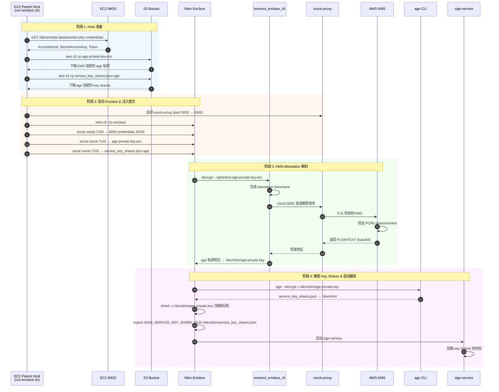
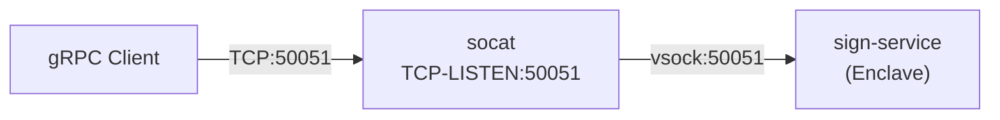
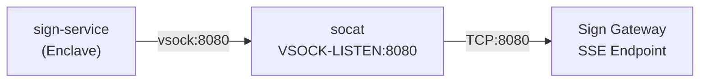
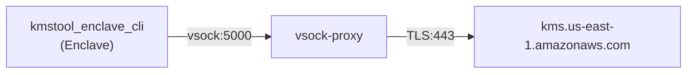
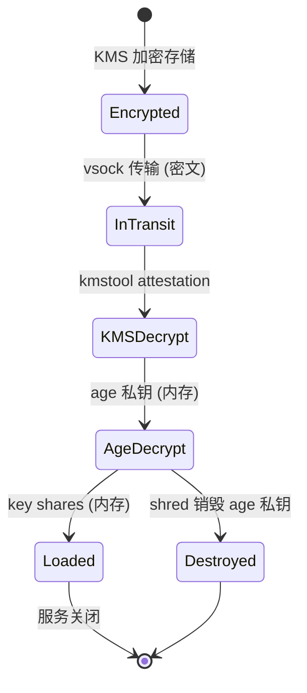

## 概述

Sign Service 采用 AWS Nitro Enclave 部署，提供高安全性的 MPC 签名服务。实例启动时预加载全部 key share 分片，并通过 vsock 通道实现与外部的安全通信。

### 核心特性

* **硬件级隔离**：Nitro Enclave 提供独立的 CPU、内存和加密证明，与 Parent EC2 完全隔离

* **零信任架构**：Parent 主机仅能访问密文，明文密钥仅存在于 Enclave 内存中

* **Attestation 验证**：KMS 解密操作需要 Enclave 提供有效的 attestation document

* **网络隔离**：Enclave 无直接网络访问，所有通信通过 vsock 通道

***

## Key Share 预加载流程



### 阶段详解

#### 1. Host 准备阶段

`run-enclave.sh` 脚本执行：

1. **获取 AWS 凭证**：从 EC2 IMDS (IMDSv2) 获取临时凭证

```bash
TOKEN=$(curl -X PUT "http://169.254.169.254/latest/api/token" -H "X-aws-ec2-metadata-token-ttl-seconds: 21600")
ROLE=$(curl -H "X-aws-ec2-metadata-token: $TOKEN" http://169.254.169.254/latest/meta-data/iam/security-credentials/)
CREDS=$(curl -H "X-aws-ec2-metadata-token: $TOKEN" http://169.254.169.254/latest/meta-data/iam/security-credentials/$ROLE)
```

* **下载加密文件**：从 S3 下载到 `/dev/shm/`（内存文件系统）

```bash
aws s3 cp s3://bucket/age-private.key.enc /dev/shm/
aws s3 cp s3://bucket/service_key_shares.json.age /dev/shm/
```

* **启动 KMS Proxy**：为 Enclave 提供 KMS 访问通道

```bash
vsock-proxy 5000 kms.us-east-1.amazonaws.com 443 &
```

#### 2. Enclave 启动与密文注入

1. **启动 Enclave**：

```bash
nitro-cli run-enclave --eif-path sign-service.eif --enclave-cid 16 --memory 512 --cpu-count 2
```

* **通过 vsock 注入密文**：

```bash
socat -u FILE:aws-credentials.json VSOCK-CONNECT:16:7100
socat -u FILE:age-private.key.enc VSOCK-CONNECT:16:7101
socat -u FILE:service_key_shares.json.age VSOCK-CONNECT:16:7102
```

#### 3. Enclave 内部 KMS 解封

`enclave-entrypoint.sh` 执行：

```bash
# 使用 kmstool 解密 age 私钥
PLAINTEXT_B64=$(kmstool_enclave_cli decrypt \
    --region us-east-1 \
    --proxy-port 5000 \
    --aws-access-key-id "$ACCESS_KEY_ID" \
    --aws-secret-access-key "$SECRET_ACCESS_KEY" \
    --aws-session-token "$SESSION_TOKEN" \
    --ciphertext "$CIPHERTEXT_B64")

# 解码并保存
echo "$PLAINTEXT_B64" | base64 -d > /dev/shm/age-private.key
chmod 600 /dev/shm/age-private.key
```

#### 4. 解密 Key Shares 并启动服务

```bash
# 使用 age 解密 key shares
age --decrypt -i /dev/shm/age-private.key \
    /tmp/service_key_shares.json.age > /dev/shm/service_key_shares.json

# 立即销毁 age 私钥
shred -u /dev/shm/age-private.key

# 设置环境变量并启动服务
export SIGN_SERVICE_KEY_SHARE_FILE=/dev/shm/service_key_shares.json
exec /usr/local/bin/sign-service /app/config/sign-service.yaml
```


***

## 通信与代理

### gRPC Ingress



Parent 启动命令：

```bash
socat TCP-LISTEN:50051,fork,reuseaddr VSOCK-CONNECT:16:50051 &
```

### HTTP/SSE Egress



Parent 启动命令：

```bash
socat VSOCK-LISTEN:8080,fork,reuseaddr TCP-CONNECT:sign-gateway:8080 &
```

### KMS Proxy




Parent 启动命令：

```bash
vsock-proxy 5000 kms.us-east-1.amazonaws.com 443 &
```


***

## 脚本与配置

### 目录结构

```plaintext
scripts/sign-service/
├── build_server.sh       # 编译 sign-service 和 kmstool
├── build-docker.sh       # 构建 Docker 镜像
├── build-eif.sh          # 构建 Enclave EIF 镜像
├── run-enclave.sh        # 启动 Enclave（主入口）
├── stop-enclave.sh       # 停止 Enclave
├── enclave-entrypoint.sh # Enclave 内部启动脚本
├── Dockerfile            # Enclave 镜像定义
└── README.md             # 详细文档
```

### 环境变量

| 变量                       | 默认值         | 说明                       |
| ------------------------ | ----------- | ------------------------ |
| `AGE_KEY_S3_URI`         | (必需)        | KMS 加密的 age 私钥 S3 路径     |
| `KEY_SHARES_S3_URI`      | (必需)        | age 加密的 key shares S3 路径 |
| `AWS_REGION`             | `us-east-1` | AWS 区域                   |
| `ENCLAVE_CID`            | `16`        | Enclave Context ID       |
| `CPU_COUNT`              | `2`         | Enclave vCPU 数量          |
| `MEMORY_MIB`             | `512`       | Enclave 内存 (MB)          |
| `KMS_PROXY_PORT`         | `5000`      | KMS vsock-proxy 端口       |
| `AWS_CREDS_VSOCK_PORT`   | `7100`      | AWS 凭证注入端口               |
| `AGE_KEY_VSOCK_PORT`     | `7101`      | age 私钥密文注入端口             |
| `KEY_SHARES_VSOCK_PORT`  | `7102`      | key shares 密文注入端口        |
| `HOST_GRPC_PORT`         | `50051`     | Host gRPC 监听端口           |
| `HOST_EGRESS_VSOCK_PORT` | `8080`      | Egress vsock 端口          |

### 使用示例

```bash
# 1. 构建
./scripts/sign-service/build_server.sh
./scripts/sign-service/build-docker.sh
./scripts/sign-service/build-eif.sh

# 2. 配置环境变量
export AGE_KEY_S3_URI=s3://my-bucket/enclave/age-private.key.enc
export KEY_SHARES_S3_URI=s3://my-bucket/enclave/service_key_shares.json.age
export AWS_REGION=us-east-1

# 3. 启动
./scripts/sign-service/run-enclave.sh

# 4. 停止
./scripts/sign-service/stop-enclave.sh
```


***

## 安全考量

### 密钥生命周期



### 安全措施

1. **传输安全**

  * 密文通过 vsock 传输，不经过网络

  * KMS 通信通过 vsock-proxy + TLS

2. **存储安全**

  * 明文仅存在于 Enclave `/dev/shm/`（内存）

  * age 私钥使用后立即 `shred` 销毁

  * AWS 凭证使用后清除

3. **访问控制**

  * KMS Key Policy 限制 PCR0 measurement

  * IAM Role 最小权限原则

  * Enclave 无直接网络访问

4. **审计追踪**

  * CloudTrail 记录 KMS 解密操作

  * Enclave console 日志保存到 Host
